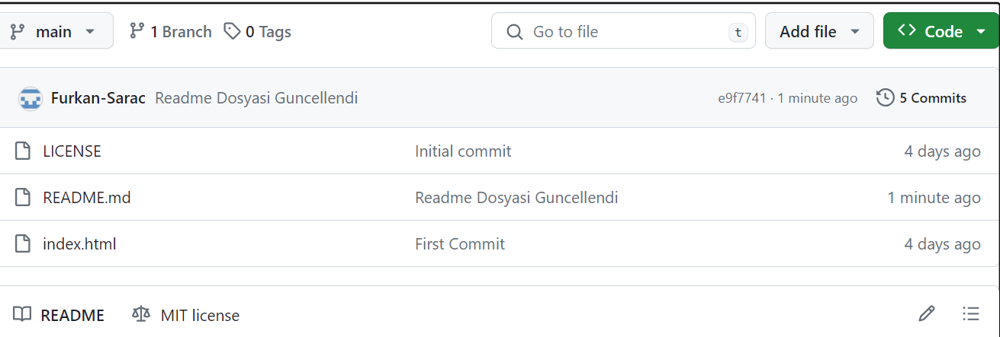

# Kodluyoruz Ilk Repo

Bu repo [kodluyoruz](https://www.kodluyoruz.org) Front-End Eğitiminde oluşturdğumuz ilk repo. İçerisinde bir adet READMe dosyasıi bir adet de index.html barındırıyor.

## Installation

Öncelikle projeyi clonelayın.

git clone <a>https://github.com/Furkan-Sarac/kodluyoruzilkrepo</a>

## Usage

Projeyi cloneladıktan sonra Visual Studio Code programında açınız.

Linux için:

cd kodluyoruzilkrepo
code .

## Contributing

Pull requestler kabul edilir. Büyük değişiklikler için, lütfen önce neyi değiştirmek istediğinizi tartışmak için bir konu açınız.

## Licanse

[MIT](https://choosealicense.com/licenses/mit/)
